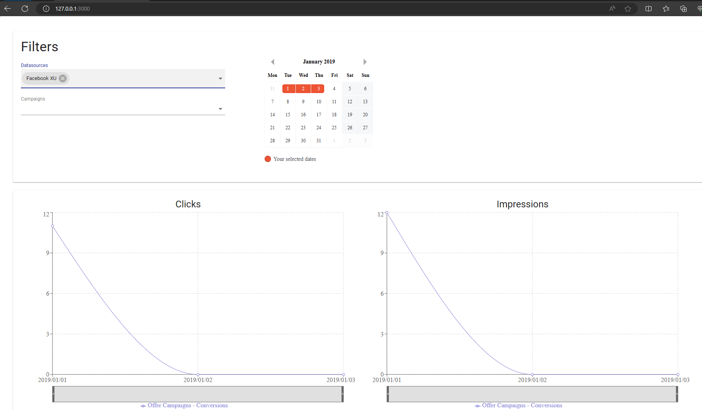

<h4>Backend: </h4>

first api: `http://127.0.0.1:8000/api/day-stats/`

possible actions:
search for id, date and field 'clicks'

exp:
`http://127.0.0.1:8000/api/day-stats/1/`
`http://127.0.0.1:8000/api/day-stats/?start_date=2019-06-01&end_date=2019-06-30&min_clicks=275`

second api:
`http://127.0.0.1:8000/api/gaz`
possible actions:
search for id
`http://127.0.0.1:8000/api/gaz/87/`

admin panel:
`http://127.0.0.1:8000/admin/` login:admin, password:admin

import data to db:

<h4>Frontend:</h4>
`http://127.0.0.1:3000/` - stolen react code taking data from api 'day-stats'

<h4>Database</h4>

PostgreSQL: default-settings:       
- POSTGRES_PASSWORD=postgres
- POSTGRES_USER=postgres
- POSTGRES_DB=postgres

<h4>How it's work</h4>
1) install Docker
2) in the root of application (where lay the file 'docker-compose.yml') write
the command in terminal:
   
   `docker-compose build`

    it's create image of our application.
3) set the setting of our application:

   `docker-compose run backend  python manage.py migrate`
      
   `docker-compose run backend  python manage.py collectstatic`
   
   `docker-compose run backend  python manage.py load_daystats_from_csv staticfiles/example_daystats_data.csv`
   
   `docker-compose run backend  python manage.py load_gaz_from_csv staticfiles/example_gaz.csv`
   
   `docker-compose run backend  python manage.py createsuperuser`

4) start application: `docker-compose up`

NOTE: Not intended for production (no nginx configuration, debug enabled).